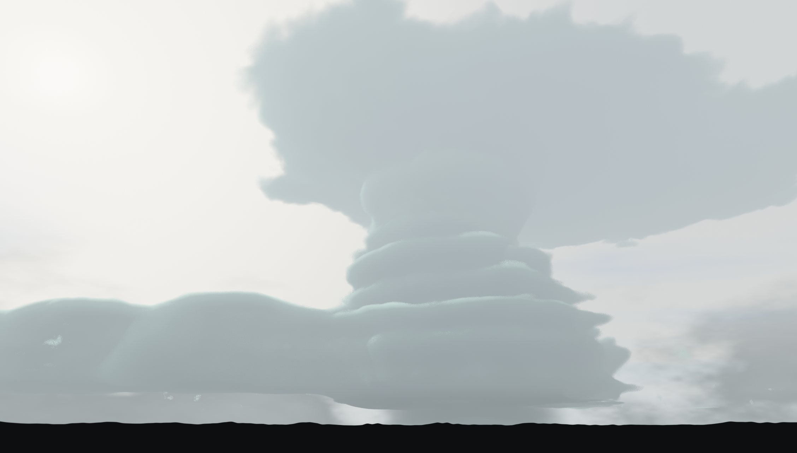

# Fulgor



Real-time volumetric cumulonimbus thunderstorm simulation — a distant storm seen
from ground level, with evolving clouds, intracloud flashes that light the cloud
interior, and branched cloud-to-ground lightning bolts. Pure JavaScript + WebGL2,
no dependencies. Look is tuned against the photos in `reference/`.

## Install

No build step, no package manager, no dependencies — it's plain HTML/JS/GLSL.

**Requirements:**
- A recent Chrome, Edge, or Firefox with WebGL2 (the app checks on load and
  shows a message if it's unavailable).
- [Node.js](https://nodejs.org) (for the `npx` static-server command below) —
  optional if you use a different local server or your editor's "Live Server"
  equivalent.

**Get the code:** copy or clone this folder — there's no package to install
inside it, just the static files (`index.html`, `js/`, `reference/`).

## Run

Any static file server works:

```
npx -y http-server -p 8172 -c-1 .
```

then open http://localhost:8172. (Or use the Claude Code preview: server name
`fulgor` in `.claude/launch.json`.)

A local server is required — opening `index.html` directly via `file://` runs
into browser restrictions on some setups, so serving it over `http://` is the
reliable path.

## Controls

- **Free camera** — drag to look, scroll to zoom, WASD to fly, Space/C for
  up/down, Shift to sprint. You can fly into and through the storm.
- **Lock on storm** (Camera panel) — the view stays aimed at the main updraft;
  dragging orbits around the storm, and flying keeps it centered. "Reset
  camera" returns to the ground-level view.
- **Simulation** — speed (0 pauses), wind, storm motion (the storm travels a
  gently meandering track roughly downwind, ~43 km/h at 1×; 0 parks it), seed +
  🎲 New storm (regenerates the cell layout and noise field, re-aims the
  camera). Rain core, wall cloud, lightning and the camera lock all follow the
  moving storm — lock mode is a storm chase. The Stage slider scrubs the storm
  through its life cycle (cumulus → mature → dissipating, after the classic
  three-stage model in `reference/`): cumulus is a short rain-free tower with
  no anvil, mature is the full supercell, dissipating rains out and erodes the
  column until only the glaciated anvil remnant lingers. "Storm lifecycle"
  auto-evolves through the cycle (≈7 min at 1× speed) and then regrows a fresh
  cell. 🔗 Copy share link puts the storm's seed and every slider/color that
  defines its look and behavior into the page URL and copies it to the
  clipboard — open that link anywhere to load the exact same storm. Render
  quality/scale, sound/volume and playback speed aren't included (those are
  your local viewing preferences, not part of the storm).
- **⚡ Randomize everything** — rerolls all colors, storm structure, sky layers,
  time of day, moon phase and color, and weather settings (leaves speed and
  render settings alone).
- **Clouds** — storm size (0.5×–2×, scales the whole cell live; height scales
  more gently and caps at the tropopause), density, coverage, and a mid-level
  scattered cumulus field that drifts between the viewer and the storm.
- **Lightning** — strike frequency, intensity, duration (average flash length;
  each event still rolls its own — quick pops through long multi-restrike
  flickers), bolt color, cloud-flash color.
- **Atmosphere** — the **Time of day** slider is the master clock (00:00
  midnight → 12:00 noon → back), and it drives both the sun and the moon. Sun
  azimuth/height are computed from the hour (sunrise due east, noon high and due
  south, sunset due west, deep below the horizon at night) and written back into
  the manual Sun azimuth/height sliders so they always mirror the sun — but grab
  either of those and you take manual control (the clock stops re-posing the sun
  until you touch Time of day again). **Auto-advance clock** winds the time
  forward for a live day/night cycle (a full 24h ≈ 10 min at 1× speed and 1×
  cycle speed); **Cycle speed** sets how fast. The sky itself (zenith/horizon
  colors, the warm halo around the sun, the shared haze tint) is driven entirely
  by sun height, not hand-picked: a clear blue zenith by day, a widening,
  reddening glow around the sun through golden hour, and a collapse into
  indigo/purple twilight — then true dark, star-filled night — once the sun
  sinks below the horizon (see "Sky model" below).
- **Moon** — a 🌙 Moon toggle renders a moon disc in the sky (subtle maria) with
  a **Moon phase** slider (0 new → 0.5 full → 1 new) that shades a correct
  curved terminator, crescent through gibbous, plus a hint of earthshine near
  full. Rendering is additive — only the lit crescent adds light, melting into
  a single soft glow, so the shadowed part is practically invisible (no dark
  disc, no outline ring). A **Moon color** picker tints both the disc and the
  moonlight (default pale ivory; push it to harvest-orange or blood-moon). By
  default the moon is **coupled to the clock** — it rides ~12h opposite the sun
  (up at night, high at midnight, down through the day) — while the phase
  slider only changes the lit fraction, never the position. **Decouple moon**
  frees the Moon azimuth/height sliders so you can pin the moon anywhere for an
  artistic look. Moonlight lights
  the night: at a bright-enough phase and elevation the moon casts a cool, dim
  directional light through the same cloud shadow-march as the sun, so cloud
  tops facing the moon are faintly rim-lit and self-shadow — night is no longer
  a black void, and its strength scales with phase (full ≈ bright, new ≈ 0) and
  moon elevation, fading out once the sun climbs.
- **Atmosphere (cont.)** — the "Ambient light" color picker no longer sets the
  sky directly; it's an optional tint/strength multiplier on top of the
  auto-computed sky-fill light (its default is neutral, so existing share links
  still load looking like themselves). Sky haze (clarity) thickens the
  horizon/aerial-perspective haze and pulls distant cloud detail down into it
  sooner. Background cloud bank and cirrus amounts, exposure.
- **Audio** — a 🔊 Sound toggle and volume. Fully procedural (no audio files):
  rain hiss (with individual pitter-patter drops) tracks the precipitation
  core and your distance to it, howling gusty wind tracks the Wind slider, a
  low rumble carries the storm's presence, and each lightning event answers
  with layered synthesized thunder — an instant electrostatic fizz at the
  flash, then a shattering crack (close ground strikes), a fluttering tearing
  peal with rapid-fire branch claps, and long rolling bass rumbles — arriving
  sooner and punchier up close, later and duller far away, spatially panned
  to where the flash happened. The whole bed follows the lifecycle stage: a
  cumulus or dissipated storm is quiet. A per-sound mixer (Rain, Wind,
  Thunder, Ambient rumble) trims each layer independently on top of the
  master volume, so you can balance the storm to taste. Sound/volume and the
  mixer are local playback preferences, not part of a shared storm.
- **Render** — quality (raymarch step counts) and resolution scale.

URL overrides: `?quality=minimal|low|medium|high|ultra&scale=0.5` (used for
weak/software GPUs, which are also auto-detected). A share link (see 🔗 Copy
share link above) adds `seed` plus the storm-identity sliders/colors on top —
these two sets of overrides are independent, so you can share a storm and
still get your own quality/scale.

## How it works

- `js/shaders.js` — a single fragment-shader raymarcher (units are km). The
  storm follows supercell anatomy (see the photos in `reference/`): one
  dominant rotating updraft — a supercell is a single cell, so only tower 0
  ever reaches the tropopause — wearing helical mesocyclone striations, topped
  by a wide disc anvil (flat base, undulating rim, drifting and elongating
  downwind with a short back-sheared edge) and an overshooting-top dome. A low
  staircase of flanking-line cumulus hugs the updraft upwind, a dark
  wall-cloud lowering hangs on the rear flank, and the precipitation core is
  displaced onto the forward flank (kept in the storm's own shadow, sun and
  sky ambient both). Cells are analytic profiles blended with
  smooth-max, eroded by domain-warped fBm noise that advects with wind and
  morphs over time; ~30% of intracloud flashes are spider crawlers weaving
  along the storm's sides and base — height is power-skewed toward the
  lower half of the cloud, so the higher up, the steeply lower the chance,
  and the origin straddles each tower's own radius so it reads as ducking
  in and out of the cloud surface. When no other branched channel is
  currently lit, these get real spider-lightning geometry (midpoint-
  displacement arms fanned out and forking in every direction, reusing the
  same generator as cloud-to-ground bolts) that visibly grows outward over
  ~0.2s rather than just glowing. Lighting = sun with a short shadow
  march (Beer–Lambert + multi-scatter floor), sky ambient, up to 3 lightning
  point lights with their own shadow taps, plus a scene-wide flicker term.
  Bolts are rendered analytically as ray-to-segment glow, occluded by the
  cloud transmittance at the bolt's depth and by the horizon treeline.
- **Sky model** — sun elevation (`uSunDir.y`) is the single driver of the sky.
  `js/main.js` walks a tuned table of color keyframes (night → dusk →
  golden-hour → day) keyed on sun-elevation degrees and smoothstep-blends
  between the nearest two into four colors uploaded as uniforms each frame:
  `uSkyZenith`/`uSkyHorizon` (the sky gradient's two ends), `uSunTint` (the
  Mie-halo color/strength around the sun — an HDR value that grows and reddens
  as the sun nears the horizon), and `uHazeCol` (the shared low-atmosphere
  tone). `js/shaders.js`'s `skyColor()` then just blends physically-shaped
  terms instead of encoding the color ramp itself: a Rayleigh-style
  `pow(1-h, 1.8)` falloff mixes zenith into horizon color, a multi-lobe Mie
  term adds the sun's forward-scatter glow, and the "Sky haze" (clarity)
  slider (`uHazeAmt`) bleeds `uHazeCol` further into the low sky. That same
  `uHazeCol` also drives the ground's horizon blend (`groundColor()`) and the
  cloud aerial-perspective fade, so sky, clouds and ground share one
  atmosphere. Clouds' sky-fill ambient light is likewise auto-derived from the
  sky model (`ambientFill()`, mixing `uSkyZenith`/`uHazeCol`) rather than a
  separately hand-tuned color; the "Ambient light" picker (`uAmbColor`) is
  normalized in JS against its own default swatch's luminance so it lands as a
  neutral ~1× multiplier at that default and only pushes the look brighter,
  dimmer, or tinted when changed.
- **Day/night clock & moon** — a single `timeOfDay` hour (0–24) is the master
  driver. `sunAzEl(hour)` turns the sun through a full 360°/day azimuth and a
  sinusoidal elevation arc (crossing zero at 06:00/18:00, peaking near noon,
  deep negative at midnight); the result feeds the same sun-elevation sky model
  above and is written back into the manual sun sliders each frame (a `sunManual`
  flag lets a hand-drag of those sliders override the clock). Auto-advance just
  winds `timeOfDay` forward. The moon's azimuth/elevation are the sun's arc
  evaluated at `hour − 24·phase`, so a full moon (phase 0.5) lags the sun by 12h
  (opposite it in the sky) and a new moon rides with it; a decouple toggle
  swaps in manual `moonAz`/`moonEl`. The moon disc is drawn in `skyColor()` as a
  small sphere: it reconstructs the near-hemisphere normal across the disc and
  Lambert-shades it against a synthesized `uMoonLightDir` (built in JS straight
  from the phase, so the terminator always matches the slider whether coupled or
  not), giving a real curved crescent→gibbous terminator, plus a soft limb,
  limb-darkening, maria mottling, earthshine and a faint corona, all tinted by
  `uMoonColor`. Moonlight (`uMoonlight`, scaled in JS by illuminated fraction ×
  moon elevation × sun-below-horizon) reuses the sun's cloud shadow-march with
  `uMoonDir` at low cool intensity; the direct-sun cloud term is gated by
  `uSunDir.y` so it switches off below the horizon and lets the moon take over
  at night.
- `js/main.js` — WebGL setup, seeded storm generation (mulberry32), slow
  convective growth cycles per cell, and the lightning scheduler: Poisson-ish
  strike timing, 65% intracloud / 35% cloud-to-ground, multi-restrike flicker
  envelopes, and midpoint-displacement bolt geometry with branches (≤48
  segments uploaded as uniforms).
- `js/audio.js` — procedural spatial sound engine, no assets: a vanilla-JS
  port of the spatial-thunder-sound-engine `AudioEngine` (its auto-strike
  scheduler removed — the sim owns all lightning timing and positions).
  Looping pink-noise beds smoothed each frame from sim state: rain through an
  intensity-tracked lowpass plus a randomized pitter-patter drop generator,
  wind through a resonant bandpass howled by two detuned gust LFOs, and a
  deep lowpassed ambient-presence rumble. Per-strike thunder is HRTF-panned
  from the flash bearing with a compressed distance delay (divided by
  playback speed so fast-forward stays in sync): an instant electrostatic
  fizz at flash time, then a waveshaped shattering crack (CG strikes bias it
  sharper), a fluttering "tearing canvas" peal with staggered branch
  micro-claps, and 5–10 layered dual-path bass rumbles (pure sub-bass plus
  saturated low-mid harmonics for small speakers) that drift as they roll.
  Everything runs through a soft compressor; the context starts on the Sound
  toggle (autoplay policy), and disabling or hiding the tab suspends cleanly,
  cancelling every pending timer and scheduled one-shot.

Debug hook: `window.__ts` exposes `params`, `camera`, `lightning`
(`lightning.force = 'cg' | 'ic'; lightning.next = 0` forces a strike),
`renderOnce()`, and `reseed(n)`.
